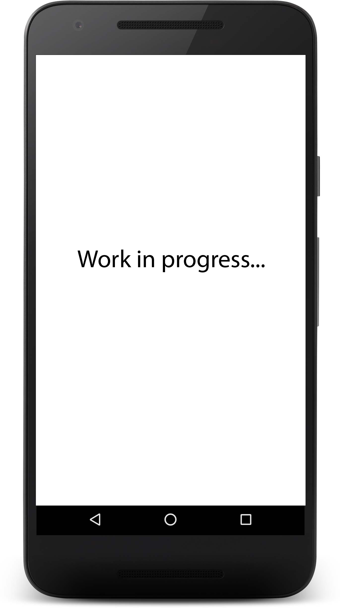

# Iello Bot Telegram #

Questa repository contiene il codice del bot Telegram di Project Iello. Il bot consente agli utenti di individuare i parcheggi per disabili presenti attorno alla propria posizione, individuata tramite i servizi di localizzazione di Telegram.

Il bot è stato pensato per permettere a tutti gli utenti che possono accedere a questa particolare piattaforma di consultare i dati raccolti dal progetto. Il bot è disponibile su Telegram con il nome di [ielloBot]().


## Indice contenuti

* [Integrazione con Iello API](#Integrazione-con-IelloApi)
* [Funzionalità del bot](#Funzionalità-del-bot)
  * [Posteggi attorno alla propria posizione](#Posteggi-attorno-alla-propria-posizione)
  * [Impostazione del raggio di ricerca](#Impostazione-del-raggio-di-ricerca)
* [Licenza](#licenza)
* [Contatti & Crediti](#contatti--credits)


## Integrazione con IelloApi ##

Il Bot sfrutta le funzioni fornite da [IelloAPI](https://github.com/IelloDevTeam/IelloAPI "Iello API Repo") per reperire i dati relativi ai parcheggi. Viene utilizzata in particolare la funzione **/parking GET**, per il download dei dati dei parcheggi attorno ad una data coordinata.



## Funzionalità del bot ##

Il codice del bot è reso accessibile al pubblico grazie al Raspberri Pi di Andrea Petreti, che sfrutta il server web nginx e telegram in modalità push *todo andri*.

Avviando il bot per la prima volta (tramite il comando */start*) viene mostrato un messaggio di benvenuto, che mostra le possibili opzioni offerte da IelloBot. </br></br></br>


### Posteggi attorno alla propria posizione ###

La principale funzione del bot è l'individuazione dei posteggi che si trovano attorno alla posizione dell'utente. La funzionalità si basa sulla funzione di geolocalizzazione di Telegram. Inviando al bot la propria posizione (click sulla graffetta in basso a sx -> posizione), o una posizione qualunque, esso restituisce delle posizioni che rappresentano per l'appunto i posteggi che si trovano attorno a tale posizione. Di dafault il raggio di ricerca è impostato a 500 metri.

Le posizioni sono codificate secondo gli standard Telegram, ragion per cui cliccando sul posteggio è possibile ad esempio eseguire operazioni come l'avvio del navigatore Google Maps con destinazione tale posizione. </br></br></br>


### Impostazione del raggio di ricerca ###

Il bot consente inoltre di impostare il raggio di ricerca, tramite il comando **/raggio**. Eseguendo tale comando specificando accanto un intero: 

```
/raggio 1000
}
```

viene impostato il raggio di ricerca per le successive ricerche per posizione. L'intero rappresenta il raggio in metri. Peculiarità di questa funzine è che il raggio scelto viene memorizzato dal bot, come se fosse una preferenza di un'app: lato server è stato implementato un database molto semplice, formato da una singola tabella con due campi (utente e raggio), che memorizza la preferenza per i successivi utilizzi. </br></br></br>


## Licenza ##
MIT License

Copyright (c) 2017 IelloDevTeam

Permission is hereby granted, free of charge, to any person obtaining a copy
of this software and associated documentation files (the "Software"), to deal
in the Software without restriction, including without limitation the rights
to use, copy, modify, merge, publish, distribute, sublicense, and/or sell
copies of the Software, and to permit persons to whom the Software is
furnished to do so, subject to the following conditions:

The above copyright notice and this permission notice shall be included in all
copies or substantial portions of the Software.

THE SOFTWARE IS PROVIDED "AS IS", WITHOUT WARRANTY OF ANY KIND, EXPRESS OR
IMPLIED, INCLUDING BUT NOT LIMITED TO THE WARRANTIES OF MERCHANTABILITY,
FITNESS FOR A PARTICULAR PURPOSE AND NONINFRINGEMENT. IN NO EVENT SHALL THE
AUTHORS OR COPYRIGHT HOLDERS BE LIABLE FOR ANY CLAIM, DAMAGES OR OTHER
LIABILITY, WHETHER IN AN ACTION OF CONTRACT, TORT OR OTHERWISE, ARISING FROM,
OUT OF OR IN CONNECTION WITH THE SOFTWARE OR THE USE OR OTHER DEALINGS IN THE
SOFTWARE.


## Contatti & Credits ##
App realizzata come parte di un progetto di esame (PDGT) da [Riccardo Maldini](https://github.com/maldins46), [Andrea Petreti](https://github.com/petretiandrea), [Alessia Ventani](https://github.com/AlessiaVe) e [Elia Trufelli](https://github.com/EliaT95).
